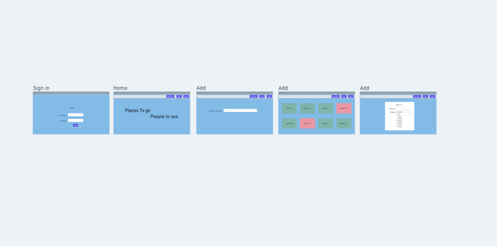

# dahliainthecity
[Click here to get to the Deployed Link](https://dahliainthecity.herokuapp.com/)

## Planning  

[Click here to get a closer look at our Trello Planning Materials](https://trello.com/b/Vr7VNdWK/dahlia-in-the-city)

### ERD & Wireframe
#### [Click here to get a closer look to the ERD and Wireframe](https://whimsical.com/dahlia-in-the-city-7mnSRs9pyuL7mDDEgUinWV)
<!--  -->

### Website Preview

## Technologies Used:
-Python
-CSS
-Django
-Git
-PostgreSQL
-Docker
-Heroku

## Next Steps
-I want to allow users to only delete their own posts.
-I want to add an edit and delete function to the todo list.

## Credits 
-Favicon by Icons8.
-https://github.com/PrettyPrinted/django_todo_app.git

## Special Thanks
-Coco
-Haydee
-Jonathan
-Brian
-Emily
-David
