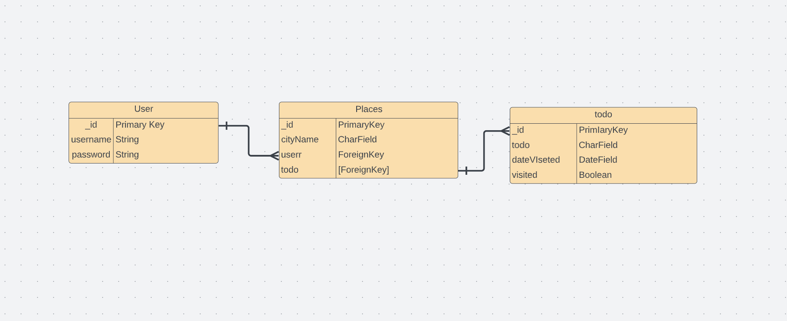

# dahliainthecity
[Click here to get to the Deployed Link](https://dahliainthecity.herokuapp.com/)

## Planning  

[Click here to get a closer look at our Trello Planning Materials](https://trello.com/b/Vr7VNdWK/dahlia-in-the-city)

### ERD & Wireframe
#### [Click here to get a closer look at the Wireframe](https://whimsical.com/dahlia-in-the-city-7mnSRs9pyuL7mDDEgUinWV)

Click here to get a closer look at the ERD](https://lucid.app/lucidspark/bb7e96e4-df20-46c5-956c-5aa6e10ca66c/edit?viewport_loc=-1098%2C-627%2C3073%2C1479%2C0_0&invitationId=inv_bd96e427-a7a9-4803-bcfa-9a69c90c548a#)

### Website Preview

## Technologies Used:

## Next Steps
- I want to allow users to only delete their own posts.
- I want to add an edit and delete function to the todo list.

## Credits 
- Favicon by Icons8.
- https://github.com/PrettyPrinted/django_todo_app.git

## Special Thanks
- Coco
- Haydee
- Jonathan
- Brian
- Emily
- David
